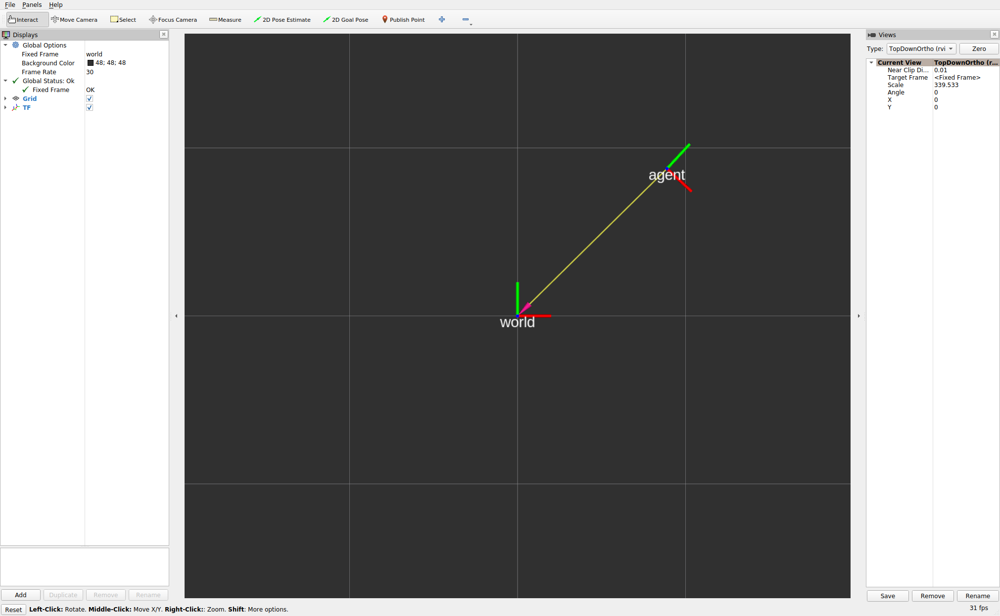
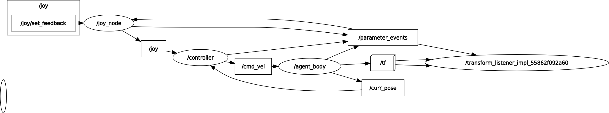

# joy_control_sample_ros2
Sample ros2 package for joy controller

## Installation
```sh
cd ~/ros2_ws/src/joy_control_sample_ros2
python3 -m pip install -I -r requirements.txt
rosdep install -i -y --from-paths .
```

## Usage
```sh
ros2 launch joy_control_sample_ros2 joy_control.launch.py
```

- rviz2


- rqt_graph


## tools
- black
```
./tools/run_black.sh
```
